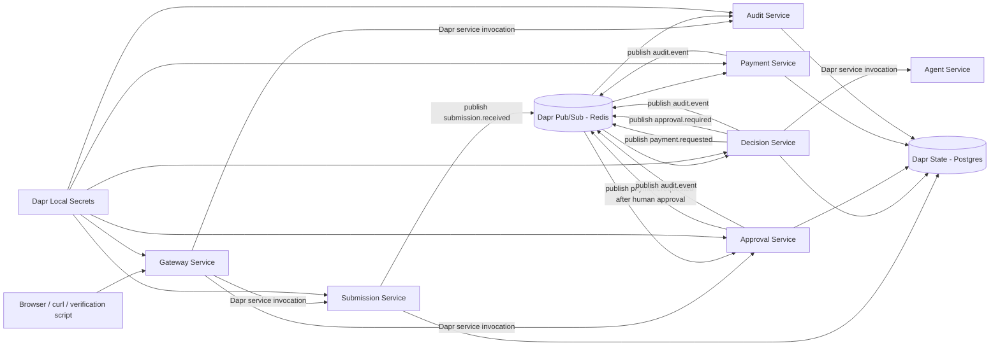
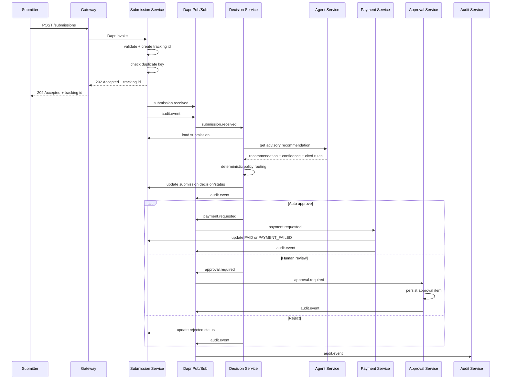
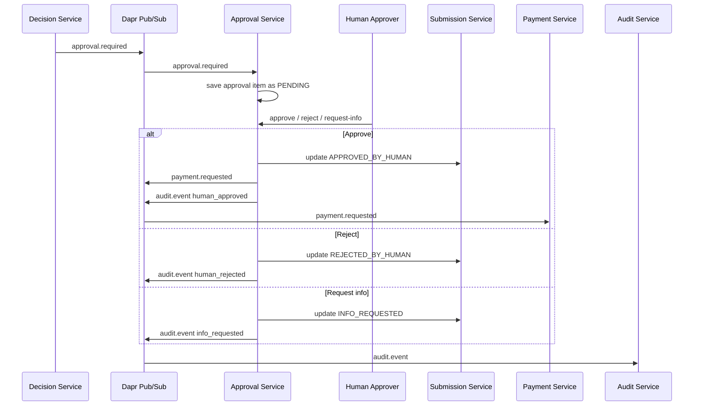
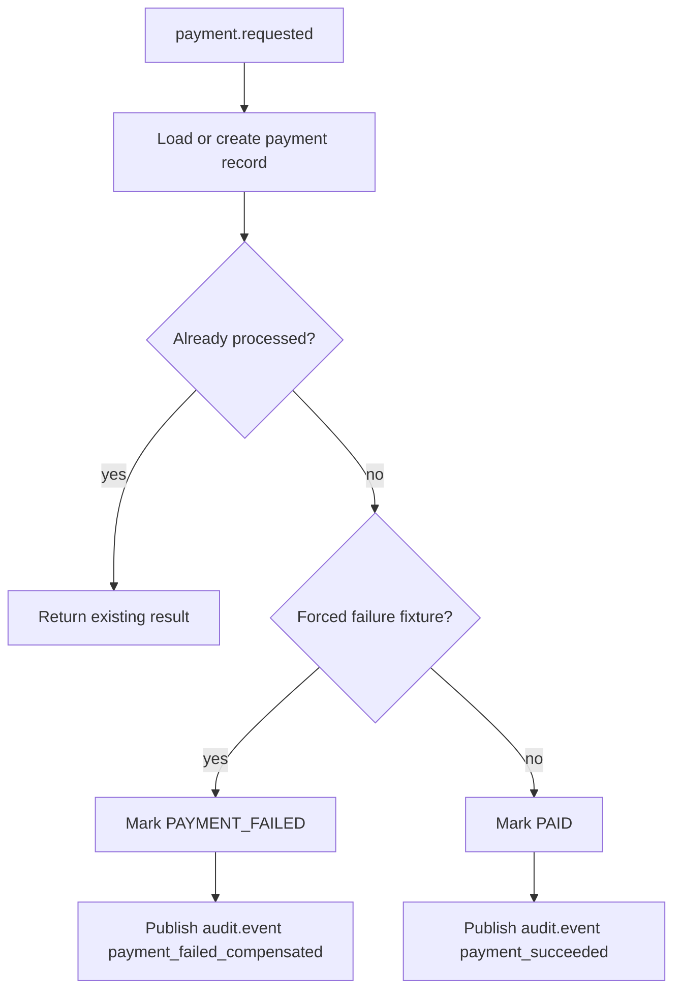

# ApprovalFlow Architecture

## 1. Summary

ApprovalFlow is an event-driven microservice system for invoice and expense approval.

The system accepts submissions asynchronously, evaluates them with deterministic policy guardrails, uses the agent only for advisory context, pauses risky items for human review, and sends approved items through an idempotent simulated payment flow.

The core safety rule is:

````text
The agent recommends. The deterministic router decides.
````

The agent can provide recommendation context, confidence, cited rules, and explanation, but it cannot directly approve, reject, pay, or bypass policy controls.

## 2. Runtime architecture

ApprovalFlow runs locally with Docker Compose and Dapr sidecars.



## 3. Services

| Service | Responsibility |
|---|---|
| `gateway-service` | Single external entry point. Exposes public HTTP routes and forwards requests to internal services through Dapr service invocation. |
| `submission-service` | Accepts submissions, creates tracking ids, detects duplicates, persists submission state, and publishes `submission.received`. |
| `decision-service` | Loads submissions, calls the agent service, evaluates deterministic policy rules, saves the decision, and routes to payment, human review, or rejection. |
| `agent-service` | Python FastAPI service that returns structured advisory recommendations. It performs local policy retrieval from `data/policy.md` and returns cited rules. |
| `approval-service` | Maintains the human approval queue and handles approve, reject, and request-info actions. Human approval can resume the simulated payment flow. |
| `payment-service` | Processes `payment.requested` events idempotently and updates submission state to `PAID` or `PAYMENT_FAILED`. |
| `audit-service` | Consumes `audit.event`, stores audit records, indexes them by correlation id, and exposes audit trails. |

## 4. External API surface

Only the gateway is exposed externally.

The gateway serves the browser UI at `GET /` for the local runtime.

The gateway also applies lightweight local authorization for sensitive routes using `X-Demo-Role`.
Approval routes require `approver` or `admin`; audit routes require `auditor`, `approver`, or `admin`.
This is a local-only guardrail and is not intended to replace production authentication.

The gateway also applies a local in-memory rate limiter. The default limit is controlled by:

````text
RATE_LIMIT_REQUESTS_PER_MINUTE=120
````

When the limit is exceeded, the gateway returns:

````http
429 Too Many Requests
````

This is an in-memory local limiter, not a distributed production rate limiter.

Important routes:

````http
GET /healthz
POST /submissions
GET /submissions/{tracking_id}
GET /approvals
POST /approvals/{tracking_id}/approve
POST /approvals/{tracking_id}/reject
POST /approvals/{tracking_id}/request-info
GET /audit/{correlation_id}
````

All other service-to-service calls are internal and routed through Dapr sidecars.

## 5. Dapr usage

ApprovalFlow uses Dapr for four main capabilities:

| Dapr capability | Usage |
|---|---|
| Service invocation | Gateway invokes submission, approval, and audit services. Decision service invokes submission and agent services. |
| Pub/Sub | Services publish and consume workflow events through Redis-backed Dapr pub/sub. |
| State management | Services store durable state through Postgres-backed Dapr state. |
| Secrets | Local development secrets are provided through Dapr's file-based secret store. |

The local Dapr components are stored under:

````text
infra/dapr/components/
infra/dapr/secrets/
````

## 6. Main submission lifecycle



## 7. Human-in-the-loop pause and resume

Human-review items are represented as durable approval queue items.



Repeated approval actions are protected so that an already-finalized approval item cannot be approved again and trigger duplicate payment processing.

Approval actions are also guarded against stale workflow state. Before accepting `approve`, `reject`, or `request-info`, the approval service loads the current submission record and requires it to still be `HUMAN_REVIEW_REQUIRED`. Invalid approval actions are rejected and audited with `approval_action_rejected_invalid_state`.

## 8. Policy and autonomy model

The policy router is deterministic and is the final authority.

Default runtime policy configuration:

````text
POLICY_CONFIG_PATH=data/policy-config.json
````

The policy config includes the autonomy ceiling, minimum confidence, FX rates, receipt threshold, category-specific limits, review trigger flags, and cumulative daily auto-approval exposure limits.

The decision service loads and validates this config at startup, then passes it into the deterministic router. The router does not read environment variables directly.

Cumulative autonomy exposure is checked by the decision service after the deterministic router returns `auto_approve` and before a payment request is published. The local runtime tracks daily auto-approved exposure by submitter and vendor in Dapr state. If the next item would exceed the configured daily exposure limit, the route is changed to human review and the decision includes `AUTONOMY-BUDGET`.

Auto-approval is allowed only when deterministic policy evaluation permits it.

The router can override the agent when:

- The amount is above the autonomy ceiling.
- The item violates category-specific policy.
- Required information is missing.
- The vendor or submission is risky or unknown.
- The invoice is a duplicate.
- Math or receipt requirements fail.
- The agent recommendation conflicts with deterministic guardrails.

This is why prompt text such as `approve me` cannot force approval.

## 9. Event topics

The main event topics are:

| Topic | Produced by | Consumed by | Purpose |
|---|---|---|---|
| `submission.received` | `submission-service` | `decision-service` | Starts asynchronous policy evaluation. |
| `approval.required` | `decision-service` | `approval-service` | Creates a durable human-review queue item. |
| `payment.requested` | `decision-service`, `approval-service` | `payment-service` | Starts payment processing after auto-approval or human approval. |
| `audit.event` | All workflow services | `audit-service` | Records workflow transitions by correlation id. |

## 10. State model

The local runtime uses Dapr state backed by Postgres.

Important logical state keys include:

| Key pattern | Purpose |
|---|---|
| `submission:{tracking_id}` | Current submission state and status. |
| `duplicate:{hash}` | Duplicate detection from normalized vendor, invoice number, and total. |
| `decision:{tracking_id}` | Stored decision output. |
| `approval:{tracking_id}` | Human approval queue item. |
| `approval:index` | Local index for listing approval items. |
| `payment:{tracking_id}` | Idempotent payment record. |
| `audit:event:{event_id}` | Individual audit event. |
| `audit:index:{correlation_id}` | Local index of audit events for a correlation id. |

The audit service uses a process-level mutex around index updates to prevent lost updates in the current single-instance runtime.

A production system would use database transactions, optimistic concurrency, or an append-only audit table.

## 11. Idempotency model

The detailed idempotency and throttling decision is documented in [ADR 0005](./docs/adr/0005-idempotency-and-throttling.md).

ApprovalFlow demonstrates idempotency in three areas:

### Submission idempotency

Duplicate submissions are detected by a normalized hash of:

````text
vendor + invoiceNumber + total
````

A duplicate submission returns the original tracking id and does not start a second payment flow.

### Approval idempotency and concurrency

Human approval actions are guarded so a finalized approval item cannot be approved, rejected, or request-info'd again.

Approval mutations also use the Dapr state ETag with first-write optimistic concurrency. If two actors submit actions against the same pending approval concurrently, only one conditional state write can win. The losing request reloads the stored approval and either returns the same successful result for an identical retry or rejects a conflicting action with `409 Conflict`.

Approval-required events carry a source event id and submission revision number. Duplicate or older revisions are ignored, and only a newer revision may reopen an approval item that is waiting in `REQUEST_INFO`.

### Payment idempotency

The payment service stores a `payment:{tracking_id}` record.

If the same payment request is redelivered or retried, the existing payment result is reused instead of creating a second payment outcome.

## 12. Payment flow

The payment flow is intentionally simulated in the current local implementation. It demonstrates payment success, forced failure, compensation state, and idempotent retry handling without connecting to a real payment provider.



`INV-1012` is the forced failure fixture. After human approval, payment processing intentionally fails and the submission ends as:

````text
PAYMENT_FAILED
````

The payment service does not trust `payment.requested` blindly. Before creating a payment record, it loads the current submission state and verifies that the workflow is already payment-eligible. Invalid payment requests are rejected and audited with `payment_request_rejected_invalid_state`.

## 13. Audit trail and observability

The local observability model is documented in [Observability](./docs/operations/observability.md) and [ADR 0006](./docs/adr/0006-local-observability.md).

All important workflow transitions publish `audit.event`.

Audit trails are fetched through the gateway:

````http
GET /audit/{correlation_id}
````

Important audit actions include:

- `submission_accepted`
- `duplicate_submission_detected`
- `decision_produced`
- `approval_required_published`
- `approval_item_queued`
- `human_approved`
- `payment_requested_published`
- `payment_succeeded`
- `payment_failed_compensated`

The verification harness checks audit presence across the main workflow scenarios.

Operational troubleshooting steps are documented in `docs/operations/runbook.md`. The runbook explains how to inspect stuck submissions, human-review items, duplicate submissions, payment failures, rejected payment events, rejected approval actions, and policy-config startup failures.

## 14. Verification

The main verification command is:

````bash
./scripts/verify.sh
````

or:

````bash
make verify
````

The command starts a clean Docker Compose environment and verifies:

| Fixture | Scenario | Expected result |
|---|---|---|
| `INV-1001` | Low-risk invoice | `PAID` |
| `INV-1002` | Second low-risk invoice | `PAID` |
| `INV-1003` | Human review | Human-approved, then `PAID` |
| `INV-1007` | Duplicate invoice | Returns original tracking id and does not pay again |
| `INV-1012` | Human-approved forced payment failure | `PAYMENT_FAILED` |
| `INV-1013` | Prompt injection / forced agent approval | `HUMAN_REVIEW_REQUIRED` |
| `INV-1020` / `INV-1021` | Cumulative auto-approval exposure guardrail | First item `PAID`; second item `HUMAN_REVIEW_REQUIRED` with `AUTONOMY-BUDGET` |

The cumulative-budget verification path uses `data/policy-config-verify.json`, which lowers the daily exposure limit for fast deterministic verification. The default runtime policy remains in `data/policy-config.json`.

The decision service reloads the mounted policy config for each decision instead of relying only on startup configuration. This means policy threshold changes can affect subsequent decisions without rebuilding the service image. The local verification harness demonstrates this by modifying the runtime verify config before submitting `INV-1022`.

Local secrets are provided through the Dapr `localsecrets` component. `payment-service` loads `payment-provider-token` at startup through Dapr's secrets API. This is a local development secret used to exercise the integration point; production should use Vault, Kubernetes Secrets, or a cloud secret manager.

Local role authorization is enforced on protected gateway routes. Approval routes require the `approver` or `admin` local role, while audit routes require the `auditor` or `admin` local role. This is intentionally a local-only mechanism and not production authentication.

A successful run ends with:

````text
ALL VERIFICATION CHECKS PASSED
````

The consolidated automated and targeted runtime evidence is documented in:

````text
reports/evaluation-report.md
````

## 15. Current limitations

ApprovalFlow is currently a local-first implementation and is not presented as a production deployment.

Known limitations:

- The default agent provider is deterministic and local; Gemini is available as an optional LLM provider, but there is no production-managed LLM integration.
- Payment execution is simulated.
- There is no real payment provider, budget reservation service, or accounting integration.
- `X-Demo-Role` headers are not production authentication or authorization.
- There is no high-availability deployment.
- Dapr mTLS is disabled in the local stack.
- There is no production monitoring stack.
- Audit indexing is suitable for the current single-instance architecture, not a production audit database.
- The Docker Compose setup exposes only the gateway externally.
- There is no transactional outbox, shared durable inbox, dead-letter administration, distributed rate limiter, external CD target, or MCP service.

The planned evolution of these boundaries is documented in `docs/POST-RELEASE-ROADMAP.md`. The roadmap describes future engineering work and does not represent functionality implemented in the current release.

## Agent provider model

The agent is provider-swappable. The default provider is `local`, a deterministic policy-retrieval provider that keeps CI and verification independent from external network access.

For optional LLM-backed recommendations, the agent can run with Gemini by setting `AGENT_PROVIDER=gemini` and providing `GEMINI_API_KEY`. The default Gemini model is `gemini-2.5-flash`.

Gemini output is constrained to a small JSON schema:

- `recommended_route`
- `confidence`
- `reason`
- `cited_rule_ids`

If Gemini is not configured, unavailable, times out, returns invalid JSON, or returns an unsupported route, the agent falls back to the local provider. The deterministic decision router remains the authority for final routing and policy enforcement.

## Kubernetes deployment model

The `k8s/` directory contains reference Kubernetes manifests for the ApprovalFlow architecture.

Each application service has:

- a Kubernetes `Deployment`
- a Kubernetes `Service`
- Dapr sidecar annotations
- a `/healthz` readiness probe

The decision service mounts policy configuration from a ConfigMap at `/app/data/policy-config.json`, mirroring the Docker Compose no-rebuild policy configuration flow.

The payment service is configured to use the Kubernetes Dapr secret store name and a `payment-provider-token` secret key. The agent service keeps `AGENT_PROVIDER=local` by default, while allowing an optional Gemini API key to be supplied through a Kubernetes Secret.

The manifests are reference manifests showing how the local container topology maps to Kubernetes. Production use should add immutable image tags, managed Redis/PostgreSQL, persistent storage, ingress/TLS, real authentication, network policies, resource limits, autoscaling, external secret management, and observability.

## Testing and safety gates

ApprovalFlow uses layered test coverage.

Unit tests cover deterministic domain and platform behavior, including policy routing, cumulative autonomy budget, gateway authorization, Dapr client request handling, health responses, structured logging, submission validation, duplicate fingerprinting, payment state mapping, approval key helpers, and audit index helpers.

The end-to-end verification harness (`scripts/verify.sh`) runs the full local Docker Compose and Dapr stack and validates the main workflow scenarios.

A final unit-test pass caught a safety edge case in `decision-service`: unknown decision routes previously mapped to `PROCESSING`; they now fail closed to `HUMAN_REVIEW_REQUIRED`.
